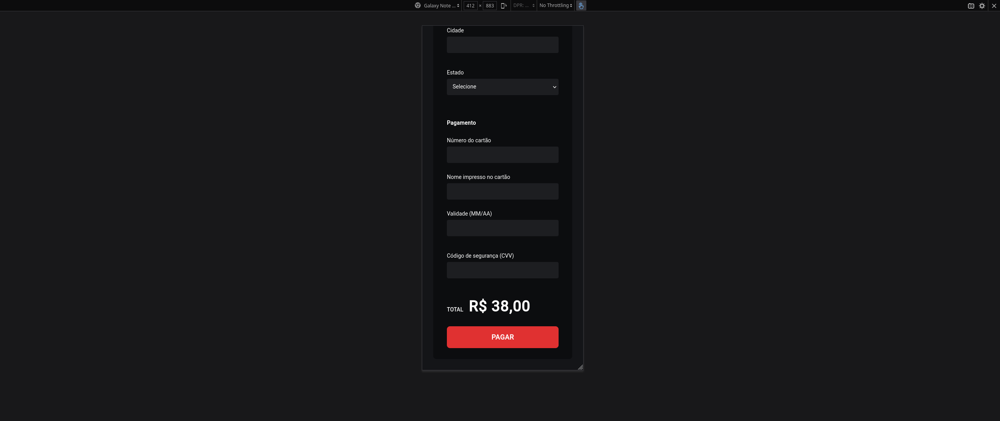

# 

## Made with
- ReactJS
- Styled Component
- NodeJS
- Express.js
- JavaScript with TypeScript
- Docker
- Prisma ORM
- PostgreSQL
- Asaas

## Run project
### Step 1
Download project. 
> **Warning**

You will need **npm** package manager

If you have **ssh** configured, so run:

```
  git clone git@github.com:pauloteixeira01/food-commerce.git
```

else

```
  git clone https://github.com/pauloteixeira01/food-commerce.git
```

Enter folder project

```
cd food-commerce
```

### Step 2
**Run back-end**
- Enter the back-end folder
- Download dependencies with command: **``npm install``**
- Run with command: **``npm run dev``**

### Step 3
**Run front-end**
- Open other terminal
- Enter the front-end folder
- Download dependencies with command: **``npm install``**
- Run with command: **``npm run start``**

### Ready!

## Screens


## Mobile





